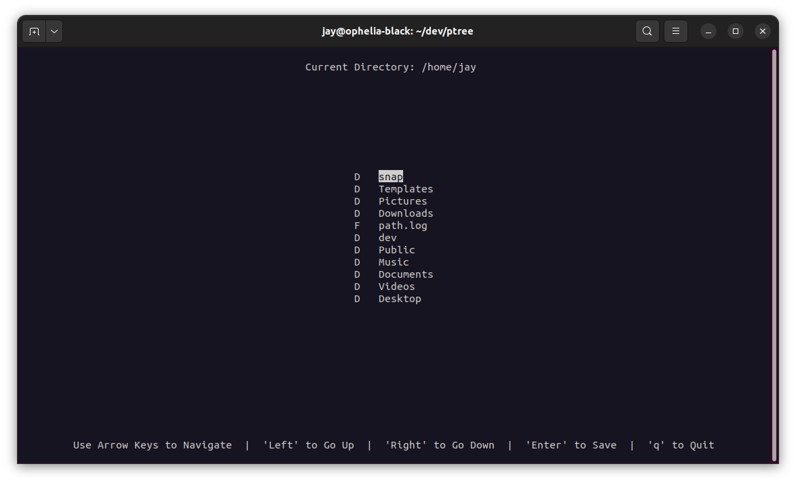
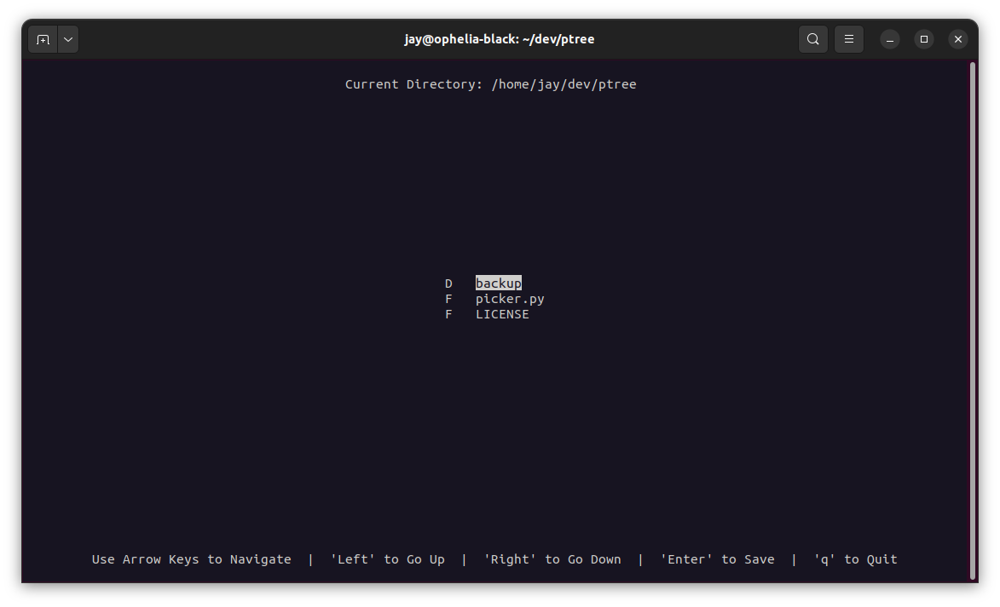

# pTREE - Python Terminal Tree Generator

pTREE is a simple terminal-based file tree grenerator written in Python using the curses library. It allows you to quickly and easily print a tree of an entire directory structure, which can then be copied into markdown code for sharing on GitHub README files, or other forms of documentation such a wikis etc.  

***This software is not fully complete - only the `picker` has been created so far.***



## Features

Currently as the picker is the only part of the software that has been developed, you can navigate the directory tree and save your current directory path to the `SELECTED_PATH` variabl, which will currently print your path to `path.log` in your pTREE project directory.

- Navigate through directories using arrow keys.
- Move up and down the directory structure with left and right arrow keys.
- Quit the program with the 'q' key.
- Clear and user-friendly interface.

## Usage

1. Clone the repository to your local machine:

```
gh repo clone j-telford/ptree

or

git@github.com:j-telford/ptree.git
```

2. Change to the project directory:

```
cd /project/directory
```

3. Create and activate a python virtual enviroment

```
python -m venv .venv && source .venv/bin/activate
```

4. Run the ptree script:

```
python picker.py

or 

python3 picker.py
```



## Controls

- Up Arrow: Move cursor up.
- Down Arrow: Move cursor down.
- Left Arrow: Navigate up the directory structure.
- Right Arrow: Navigate down the directory structure.
- 'q' Key: Quit the program.

## Requirements

- Python 3.x
- curses library (usually included with Python)

## License

This project is licensed under the MIT License. See the [LICENSE](LICENSE) file for details.

